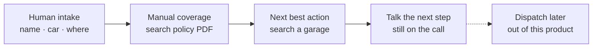
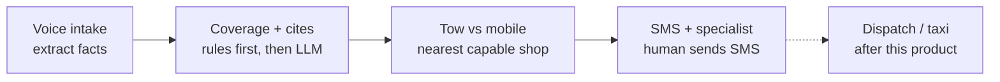

# Northline Assist — Product Requirements Document

**Client:** Northline Mutual (personal auto) · **Product:** Northline Assist · **Audience:** claims operations and IT · **Status:** M0 prototype · **Length:** 2 pages max

## Vision

Northline’s roadside queue is a 12–18 minute phone ritual: a human writes down facts, hunts the policy, searches for a garage, and narrates next steps while the member waits on the shoulder. **Northline Assist** is a copilot that runs that same four-step job—intake, coverage, next-best-action, customer update—in a few minutes, with citations a supervisor can audit.

Goals for a 90-day pilot on one metro queue: (1) median handle time under 6 minutes, (2) every coverage answer cites a policy section, (3) zero autonomous denials, (4) after-hours coverage without adding headcount. We are not replacing dispatch, claims, or the human who is liable when we are wrong.

## Before / after

**Before — every box is a person with a headset (12–18 min).** Errors concentrate in coverage and garage selection. Dispatch is later and out of this product.

**After — Assist runs the four boxes; a specialist still closes the case.** SMS is drafted only. Approve sends the coverage text; Decline sends the hold text. Dispatch stays out of v1.

State path: `gathering → assessing → recommending` (only if covered) `→ notifying → awaiting_human → closed`.

## Key features (what shipped in the prototype)

1. **Voice intake (laptop mic).** A constrained agent gathers name, vehicle, location, disablement type, situation, and whether the operator is a listed driver. It does not discuss coverage or promise a truck. Chrome Web Speech + optional TTS; typing is a fallback if the microphone is unavailable.
2. **Cited coverage check.** After intake, a state machine retrieves policy sections (RAG-lite over the member’s endorsement) and an LLM returns `{decision, citations, rationale, confidence}`. Hard rules fire first: lapsed policy, unlisted driver, racing/track, Standard vs Plus collision. The model cannot override a hard exclusion.
3. **Next-best-action.** Tow vs. mobile repair is a rule table (flat/battery/lockout → mobile; collision/engine → tow). The nearest partner with that capability is a haversine lookup. The model does not invent garages.
4. **Customer SMS.** Assist drafts a member text after coverage. Nothing is sent until a specialist **Approves** (coverage message) or **Declines** (hold/denial). The specialist may edit the draft first. The customer inbox is a web stand-in for SMS.
5. **Human observer.** A second UI streams transcript, extracted facts, citations, and the recommended garage. Specialists approve, decline, override (with a note), and edit SMS. Roadside is a regulated conversation with a person on the line.

## Prioritization

We automated **only the four boxes humans already do on the phone**, because that is where time and error live, and because it can ship without core-system writes.

| In v1 (now) | Explicitly out |
|---|---|
| Voice intake, coverage with cites, garage pick, SMS, human review | Telephony/IVR, photo damage models, dispatch write-back, taxi/rental, auth, multilingual |

Deferred work is **higher liability or harder integration**. Dispatch and rental booking write to vendor networks; a wrong tow is a cost and a safety event. Photo damage assessment is a different product (see below). Those belong in later milestones, not in the first workflow.

## Milestones

- **M0:** Prototype on synthetic Atlanta members. 100% human review. Success = covered mobile, covered tow, and unlisted-driver hold all complete end to end.
- **M1 (2–3 weeks):** One live queue, humans on every case, read-only policy feed, eval set of 50 historical calls (deny precision, citation groundedness, extraction F1). Kill switch = hide the recommend panel, keep the phone.
- **M2 (30–45 days):** Telephony (CCaaS) + identity against policy admin. STT with barge-in. PII redaction before the LLM. Still no dispatch write.
- **M3:** Dispatch vendor API with idempotent job ids; taxi/rental as a **human-clicked** concierge; overnight evals; after-hours staffing. Photo intake as an advisory card, never a coverage decision.

## Technical risks

- **STT on a roadside call:** wind, speakerphone, accents. Mitigate with confirm-back of extracted facts (“flat tire on Piedmont—yes?”) and a type/DTMF fallback.
- **Policy RAG hallucination:** the model cites a section that does not say that. Mitigate with retrieval-only excerpts, JSON schema, hard-rule preflight, and groundedness evals before a specialist may send.
- **PII in prompts:** members on a live call. Mitigate with a VPC/processor agreement, redaction, and a self-host option if residency is required.
- **Latency:** a silent 4s gap feels like a dropped call. Mitigate with filler TTS, smaller models for fact extraction, streaming later.
- **Garage freshness:** closed shop, wrong hours. Mitigate with vendor SLA and a human confirm on ETA.
- **Liability:** denials never auto-close. The observer owns the decision; the transcript is the audit log.

## AI integration — damage assessment (not in this prototype)

Roadside v1 does **not** look at photos. If Northline later wants damage assessment (collision severity, airbag, driveable-or-not), treat vision as **advisory evidence for a human**, not as coverage:

1. Member (or first notice of loss) uploads 4–8 images; EXIF and a replay hash go to the audit store.
2. A vision model returns structured hints (`driveable`, `airbags`, `fluid leak`, bounding boxes) with a calibrated confidence. Below threshold → `needs_review`, no number on screen that looks like a settlement.
3. The adjuster sees photos + hints + the **policy citation path from this prototype**. Accept/edit writes to claims core from **our** API, not from the model.
4. Controls: spoofing/replay tests, lighting/angle eval slices, refusal when the photo is not the insured VIN, and a kill switch that leaves the photo pane up and hides the model card.

Same design as coverage: **workflow is a state machine we own; the model fills structured facts inside a box; writes go through a human.**
